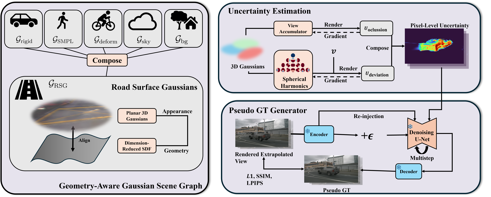

<h3>ExtraGS: Geometric-Aware Trajectory Extrapolation with Uncertainty-Guided Generative Priors</h3>

Kaiyuan Tan1,2, Yingying Shen2, Haohui Zhu2, Zhiwei Zhan2, Shan Zhao2, Mingfei Tu2, Hongcheng Luo2, Haiyang Sun2†, Bing Wang2✉, Guang Chen2, Hangjun Ye2

1UIUC
2Xiaomi EV  

(†) Project leader. (✉) Corresponding author.  

<!-- ## Introduction -->
## Abstract
Synthesizing extrapolated views from recorded driving logs is critical for simulating driving scenes for autonomous driving vehicles, yet it remains a challenging task. Recent methods leverage generative priors as pseudo ground truth, but often lead to poor geometric consistency and over-smoothed renderings. To address these limitations, we propose ExtraGS, a holistic framework for trajectory extrapolation that integrates both geometric and generative priors. At the core of ExtraGS is a novel Road Surface Gaussian(RSG) representation based on a hybrid Gaussian-Signed Distance Function (SDF) design, and Far Field Gaussians (FFG) that use learnable scaling factors to efficiently handle distant objects. Furthermore, we develop a self-supervised uncertainty estimation framework based on spherical harmonics that enables selective integration of generative priors only where extrapolation artifacts occur. Extensive experiments on multiple datasets, diverse multi-camera setups, and various generative priors demonstrate that ExtraGS significantly enhances the realism and geometric consistency of extrapolated views, while preserving high fidelity along the original trajectory.
         

## Overview

<!-- ## News

